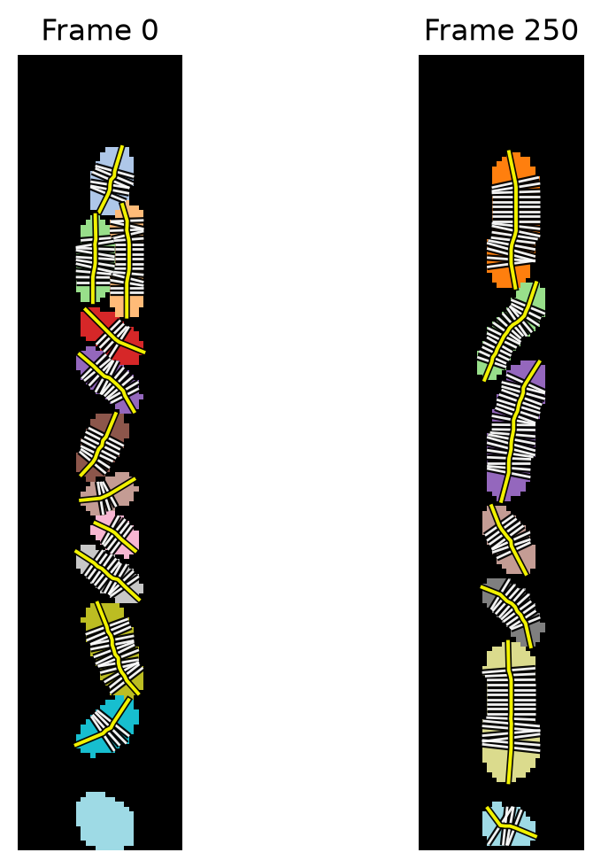

# cell-regionprops

`regionprops_table`-style measurements for labeled masks of cells, including a reimplementation of Voronoi mesh-based cell morphometrics for labeled microscopy masks as demonstrated in [Ursell et al](https://doi.org/10.1186/s12915-017-0348-8).

## Install:

`pip install git+https://github.com/georgeoshardo/cell-regionprops.git`

## Tiny Example

```python
from pathlib import Path

import numpy as np
import zarr

from cell_regionprops import stack_regionprops_table

# Load one complete labelled-mask time series included with the package.
mask_path = Path("examples/data/demo_label_masks.zarr")
masks = np.asarray(zarr.open_array(mask_path, mode="r"))[:1]
pixel_size_um = 0.107869821220548

# Measure every labelled object in the loaded frames.
table = stack_regionprops_table(
    masks,
    index_names=("sample", "frame"),
    properties=("label", "area", "centroid", "moments_axis", "morphometrics"),
    pixel_size=pixel_size_um,
    moments_backend="numba",
    morphometrics_n_jobs=-1,
)

table.head()
```

Array-valued mesh columns are abbreviated by shape.

| sample | frame | label | area_px | area | centroid_y | centroid_x | length_px_moments | width_px_moments | length_moments | width_moments | length_px_morphometrics | width_px_morphometrics | length_morphometrics | width_morphometrics | volume_morphometrics | surface_area_morphometrics | surface_area_to_volume_ratio_morphometrics | method_morphometrics | centerline_xy_morphometrics | width_profile_px_morphometrics | mesh_px_morphometrics |
| ---: | ---: | ---: | ---: | ---: | ---: | ---: | ---: | ---: | ---: | ---: | ---: | ---: | ---: | ---: | ---: | ---: | ---: | ---: | :--- | :--- | :--- |
| 0 | 0 | 1 | 101 | 1.18 | 25.36 | 18.92 | 14.82 | 8.66 | 1.60 | 0.93 | 14.35 | 8.24 | 1.55 | 0.89 | 0.78 | 4.32 | 5.57 | contour_voronoi_rib_intersections | array(8, 2) | array(8,) | array(8, 4) |
| 0 | 0 | 2 | 146 | 1.70 | 42.03 | 22.20 | 26.08 | 7.38 | 2.81 | 0.80 | 23.34 | 6.36 | 2.52 | 0.69 | 0.84 | 5.42 | 6.42 | contour_voronoi_rib_intersections | array(18, 2) | array(18,) | array(18, 4) |
| 0 | 0 | 3 | 116 | 1.35 | 41.85 | 15.35 | 18.39 | 8.04 | 1.98 | 0.87 | 18.06 | 7.81 | 1.95 | 0.84 | 0.93 | 5.16 | 5.55 | contour_voronoi_rib_intersections | array(12, 2) | array(12,) | array(12, 4) |
| 0 | 0 | 4 | 98 | 1.14 | 57.49 | 18.94 | 15.98 | 7.87 | 1.72 | 0.85 | 15.13 | 7.20 | 1.63 | 0.78 | 0.65 | 3.98 | 6.12 | contour_voronoi_rib_intersections | array(6, 2) | array(6,) | array(6, 4) |
| 0 | 0 | 5 | 106 | 1.23 | 66.46 | 18.42 | 17.31 | 7.88 | 1.87 | 0.85 | 16.63 | 7.28 | 1.79 | 0.79 | 0.74 | 4.43 | 5.96 | contour_voronoi_rib_intersections | array(12, 2) | array(12,) | array(12, 4) |

```python
import matplotlib.pyplot as plt

from cell_regionprops import plot_meshes_over_mask

# Plot the contour-rib mesh for two frames.
colors = plt.get_cmap("tab20")(np.linspace(0, 1, 20))
colors[0] = [0, 0, 0, 1]
mask_cmap = plt.matplotlib.colors.ListedColormap(colors)

fig, axes = plt.subplots(1, 2, figsize=(6.0, 5.0), sharey=True)
for ax, frame in zip(axes, (0, 250)):
    frame_table = table.query("sample == 0 and frame == @frame")
    plot_meshes_over_mask(masks[0, frame], frame_table, ax=ax, mask_cmap=mask_cmap)
    ax.set_title(f"Frame {frame}")
plt.tight_layout()
plt.show()
```


